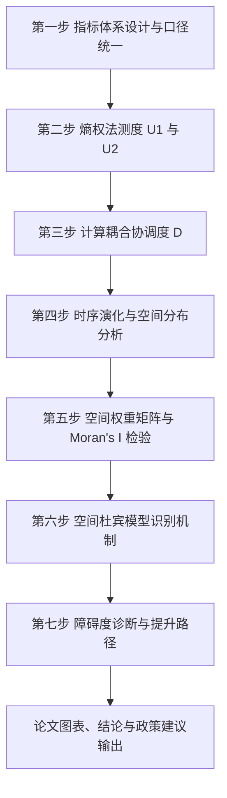

<div align="center">

# GBA-Coupling-Coordination

### 基于耦合协调模型的粤港澳大湾区新质生产力与区域协调发展研究


</div>

本仓库用于支撑“粤港澳大湾区新质生产力与区域协调发展”研究的模型设计、文档整理与后续实证实现。当前阶段以研究框架搭建为主，核心任务是：围绕大湾区 11 个城市，构建新质生产力与区域发展双系统指标体系，测度耦合协调水平，识别空间溢出机制，并形成差异化提升路径。

> 当前仓库仍处于“文档先行、模型定稿、代码待补充”阶段，后续将逐步补充数据处理、测度计算、空间计量与可视化分析代码。

## 快速导航

- [项目简介](#project-overview)
- [研究背景与问题](#research-background)
- [研究目标](#research-goals)
- [研究对象与范围](#scope)
- [工作流程](#workflow)
- [方法链条说明](#method)
- [仓库状态](#status)
- [当前目录](#current-structure)
- [文档分类建议](#docs-categories)
- [论文对应关系](#paper-mapping)
- [已有文档](#docs)
- [后续计划](#roadmap)

<a id="project-overview"></a>
## 项目简介

`GBA-Coupling-Coordination` 聚焦粤港澳大湾区背景下“新质生产力提升”与“区域协调发展”之间的互动关系。

项目不是只做单一系统测度，而是围绕一个完整的研究链条展开：

1. 先构建新质生产力系统与区域发展综合水平系统。
2. 再通过熵权法得到两个系统的综合指数。
3. 进一步用耦合协调模型测度双系统适配程度。
4. 随后考察时序演化、空间分布与城市差异。
5. 最后结合空间计量和障碍度诊断，解释机制并提出提升路径。

这意味着本仓库既是一个论文研究仓库，也是一个方法实现仓库。后续代码实现将围绕“指标测度 -> 耦合协调 -> 空间相关 -> SDM -> 障碍诊断”这条主线展开。

<a id="research-background"></a>
## 研究背景与问题

在新一轮科技革命、产业变革和高质量发展转型背景下，“新质生产力”已成为理解区域竞争力和发展质量的重要切口。粤港澳大湾区作为我国开放程度高、创新资源密集、产业体系完整的核心区域，其发展并不是简单的总量增长问题，而是创新能力、产业升级、要素流动、基础设施联通、制度衔接与生态支撑共同作用下的系统协同问题。

现实中，大湾区内部仍具有明显的“核心-边缘”网络特征。核心城市在创新要素集聚和高端功能承载方面占优，外围城市则面临承接能力、联通效率和协同机制不足等约束。因此，本研究关注的不只是“谁发展得更快”，还包括：

- 新质生产力与区域发展是否同步提升。
- 两个系统之间是否处于协调状态。
- 城市间是否存在显著空间溢出与空间依赖。
- 核心城市对周边城市表现为辐射效应还是虹吸效应。
- 不同类型城市的关键短板在哪里，应如何分类施策。

<a id="research-goals"></a>
## 研究目标

围绕上述问题，项目当前对应四个核心研究目标：

1. 构建双系统测度体系。
   形成适配大湾区特征的新质生产力评价体系，以及区域发展综合水平评价体系。
2. 测度双系统耦合协调水平。
   量化评估各城市新质生产力与区域发展的适配程度，并刻画其时间变化与空间分布。
3. 识别空间溢出与互动机制。
   通过空间自相关检验与空间杜宾模型，识别城市间的空间传导关系。
4. 寻找区域协同提升路径。
   结合障碍度模型与分组比较，诊断不同城市的关键约束并形成差异化建议。

<a id="scope"></a>
## 研究对象与范围

- 研究区域：粤港澳大湾区 11 个城市
- 城市样本：广州、深圳、香港、佛山、东莞、珠海、中山、惠州、肇庆、江门、澳门
- 研究期：`2015-2024`
- 面板规模：`11 × 10 = 110` 个城市-年份观测
- 第六步 SDM 样本期：`2016-2024`
  因解释变量采用滞后一期处理，第六步有效观测为 `11 × 9 = 99`

<a id="workflow"></a>
## 工作流程



更具体地说，这个项目的实际工作顺序如下：

1. 整理统计口径，统一内地与港澳数据来源、单位和口径。
2. 搭建双系统指标库，区分内部测度指标与外部驱动变量。
3. 用熵权法计算新质生产力指数 `U1` 和区域发展综合水平指数 `U2`。
4. 用耦合协调模型计算核心结果变量 `D`。
5. 通过趋势图、箱线图、排序图和地图观察演化格局。
6. 构建空间权重矩阵并检验是否存在空间自相关。
7. 用 SDM 识别本地效应、空间溢出效应及辐射/虹吸机制。
8. 用障碍度模型识别短板指标，并映射到提升路径与政策建议。

<a id="method"></a>
## 方法链条说明

### 1. 双系统指标体系

- `U1`：新质生产力系统
  包含科技创新投入、科技创新产出、产业高端化/新动能、数字化与绿色化四个维度。
- `U2`：区域发展综合水平系统
  包含经济发展基础、创新协同基础、要素流动与联通能力、公共服务与生态支撑四个维度。

这里有一个研究设计上的关键点：`U2` 不直接命名为“区域协调发展系统”，而是定义为“区域发展综合水平系统”，避免和耦合协调度 `D` 形成概念循环。也就是说，“协调”是两个系统之间的关系结果，而不是某一个系统本身。

### 2. 熵权法测度

项目采用全样本池化熵权法，对两个系统分别计算指标权重，再合成为：

- `U1_it`：城市 `i` 在年份 `t` 的新质生产力综合指数
- `U2_it`：城市 `i` 在年份 `t` 的区域发展综合水平指数

池化处理的目的，是优先保证跨年份可比性。后续稳健性部分会与逐年熵权法、替代标准化方法进行对照。

### 3. 耦合协调模型

基于 `U1` 和 `U2`，计算：

- 耦合度 `C`
- 综合协调指数 `T`
- 耦合协调度 `D`

其中 `D` 是本研究后续全部分析的核心结果变量，用于刻画“新质生产力”和“区域发展”之间是否处于高水平协调状态。

### 4. 演化与分布分析

围绕 `D` 展开描述性分析，重点回答两个问题：

- 大湾区整体协调度是否提升。
- 城市间差距是收敛还是分化。

计划使用的分析与展示形式包括：

- 年度趋势图
- 箱线图
- 城市排序图
- 空间分级图
- 变异系数对比

### 5. 空间相关检验

在进入空间计量之前，先完成两项基础工作：

- 构建空间权重矩阵
  主矩阵采用地理距离倒数矩阵，稳健性检验中使用经济距离矩阵。
- 计算全局 Moran's I
  判断耦合协调度是否具有显著空间自相关。

### 6. 空间杜宾模型

若存在空间依赖，则进一步使用空间杜宾模型识别外部驱动因素的本地效应和空间溢出效应。主规格外部驱动变量包括：

- `rdi`：研发投入强度
- `ind`：产业高级化水平
- `dig`：数字化水平
- `open`：开放度

这一部分的核心不是只看系数显著性，而是通过效应分解判断：

- 哪些因素对本城市协调发展有直接推动作用
- 哪些因素会通过空间渠道影响周边城市
- 核心城市作用更多表现为“辐射”还是“虹吸”

### 7. 障碍度诊断与提升路径

最后一步通过障碍度模型识别各城市的关键短板指标，再与第六步识别出的机制变量进行映射，形成差异化提升路径。

这一部分会重点区分：

- 核心城市
- 次核心城市
- 外围城市
- 澳门单独分析

这样可以避免把所有城市放进一个统一政策框架里，提升结论的针对性。

<a id="status"></a>
## 仓库状态

| 标签 | 内容 |
| --- | --- |
| 当前阶段 | 模型设计与研究文档整理 |
| 研究主线 | 新质生产力测度 + 区域发展测度 + 耦合协调分析 |
| 当前产物 | 最终模型设计文档、README |
| 代码状态 | 尚未开始系统化落地 |
| 下一步重点 | 数据口径表、指标清单、测度与空间计量代码 |

<a id="current-structure"></a>
## 当前目录

```text
GBA-Coupling-Coordination/
├─ docs/
│  └─ 最终完整模型设计.docx
└─ README.md
```

当前仓库结构非常简洁，说明项目目前的重点还在于把研究逻辑、模型设计和文档体系先定下来。

<a id="docs-categories"></a>
## 文档分类建议

随着项目推进，建议后续将 `docs/` 目录逐步细化为以下几类：

- `docs/model/`
  存放总模型设计、公式说明、步骤拆解、变量关系图。
- `docs/data/`
  存放指标口径表、数据源说明、港澳替代变量说明、缺失处理规则。
- `docs/literature/`
  存放文献综述、文献笔记、方法来源整理、分主题参考文献。
- `docs/method/`
  存放熵权法、耦合协调模型、Moran's I、SDM、障碍度模型的实现说明。
- `docs/paper/`
  存放论文提纲、章节草稿、图表清单、结果写作提纲。
- `docs/notes/`
  存放阶段记录、问题清单、参数选择说明、稳健性检查备忘。

如果后续代码和数据模块逐步补齐，建议仓库整体结构演进为：

```text
GBA-Coupling-Coordination/
├─ data/
│  ├─ raw/          # 原始统计数据
│  ├─ interim/      # 清洗后的中间数据
│  └─ processed/    # 建模输入数据
├─ docs/
│  ├─ model/        # 模型设计与公式说明
│  ├─ data/         # 指标口径与数据源说明
│  ├─ literature/   # 文献笔记与综述
│  ├─ method/       # 方法实现说明
│  ├─ paper/        # 论文写作材料
│  └─ notes/        # 阶段记录
├─ src/
│  ├─ indicators/   # 指标整理与标准化
│  ├─ entropy/      # 熵权法测度
│  ├─ coupling/     # 耦合协调度计算
│  ├─ spatial/      # Moran's I 与 SDM
│  └─ obstacle/     # 障碍度模型
├─ notebooks/       # 探索性分析与图表草稿
├─ outputs/
│  ├─ tables/       # 表格结果
│  ├─ figures/      # 图形结果
│  └─ maps/         # 空间制图输出
└─ README.md
```

<a id="paper-mapping"></a>
## 论文对应关系

这个项目的仓库工作流，与论文写作逻辑基本一一对应：

| 仓库工作 | 论文对应内容 |
| --- | --- |
| 研究背景与研究问题整理 | 引言与研究意义 |
| 双系统指标体系构建 | 研究设计与指标说明 |
| 熵权法测度 `U1`、`U2` | 综合评价方法 |
| 耦合协调度 `D` 计算 | 双系统协调测度 |
| 分布与演化分析 | 实证结果一：时空格局 |
| Moran's I 与 SDM | 实证结果二：空间机制 |
| 障碍度诊断与路径建议 | 实证结果三：短板与政策建议 |

换句话说，README 里描述的工作流程，不只是项目执行顺序，也是论文成稿时的主要章节骨架。

<a id="docs"></a>
## 已有文档

- [最终完整模型设计](./docs/最终完整模型设计.docx)

该文档目前是本仓库最核心的设计文件，包含：

- 完整符号体系
- 七步模型链条
- 空间计量与效应分解设计
- 障碍诊断与提升路径逻辑
- 模型完整性与文献支撑关系

如果你第一次阅读这个仓库，建议先按这个顺序进入：

1. 先看本 README，理解项目目标、流程和仓库定位。
2. 再看 `docs/最终完整模型设计.docx`，掌握完整方法细节。
3. 后续补充代码后，再按照数据处理、测度计算、空间分析的顺序阅读实现模块。

<a id="roadmap"></a>
## 后续计划

- 补充双系统指标清单与数据口径说明
- 建立港澳与内地统计口径统一规则表
- 整理 2015-2024 年城市面板数据
- 实现熵权法与耦合协调度计算模块
- 实现 Moran's I 与空间杜宾模型分析模块
- 实现障碍度诊断与分组比较模块
- 输出论文图表、结果表与写作提纲

## 说明

这个仓库的价值，不在于“已有多少代码”，而在于已经把研究问题、指标框架、方法链条和后续实现顺序锁定下来。对当前阶段来说，最重要的是先把模型逻辑、文档结构和实证路径统一，再逐步落到数据与代码实现上。
